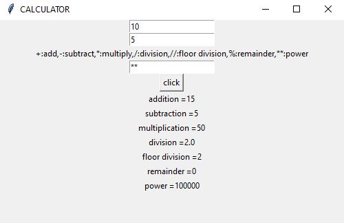
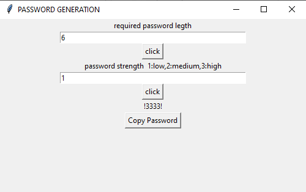
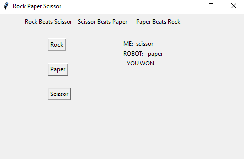

# Python Calculator

This is a simple calculator made using Python Tkinter.

## Program Output

# Python password generator

it generate the password with any specific and with different complexity of the password

## Program Output

# Rock-paper-scissor

a simple game we can play with robot by choosing an option and shows who wins

## Program Output

